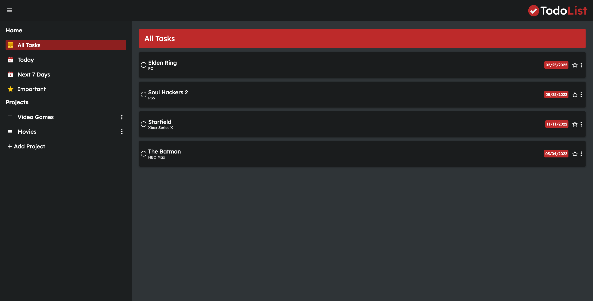

# todo-list

### Features:

- Create new projects/tasks
- Edit project's title
- Edit task's details (title, description, due date)
- Delete new projects/tasks
- Mark tasks as complete/incomplete
- Mark tasks as important/unimportant
- Sort tasks by date (daily or weekly)
- Sort tasks by important status

### Built With:

- HTML
- CSS
- Javascript
- Webpack

### Libraries Used:

- date-fns
- uu

